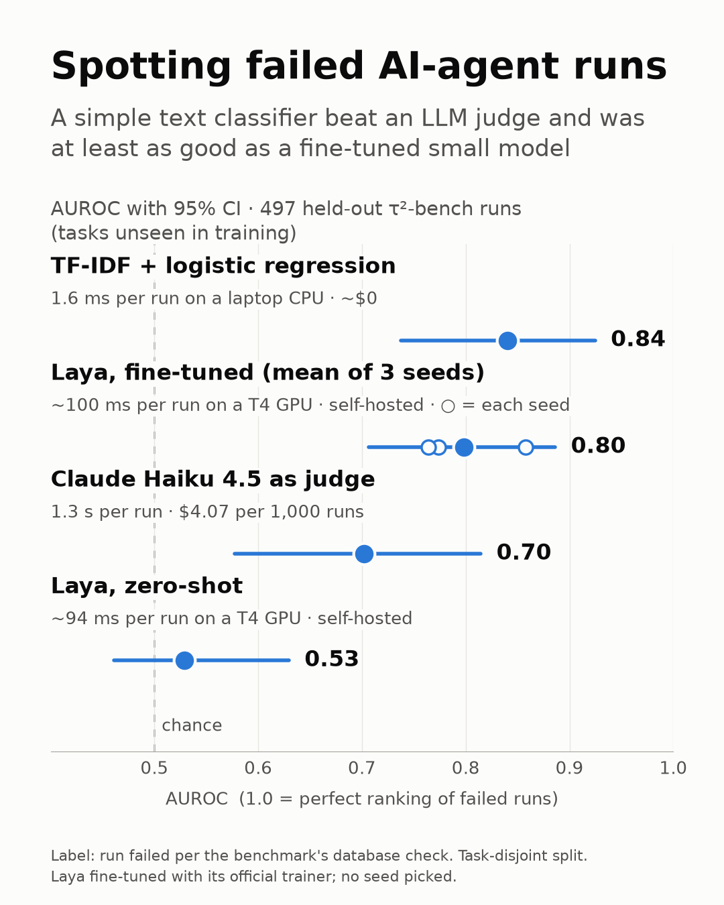

# Can Laya replace an LLM judge for flagging failed agent runs?

**Short answer: zero-shot, no. Fine-tuned Laya is statistically tied with the LLM judge, but so
is a free 1.9 ms TF-IDF model, so neither is worth the extra cost on this data.** We compared four ways to flag customer-service agent runs
that failed: a TF-IDF + logistic regression baseline, Laya zero-shot, Laya fine-tuned with its
official trainer, and Claude Haiku 4.5 as an LLM judge. Every model was evaluated on tasks it
never saw. The TF-IDF baseline on the last 1,024 tokens of each run scored highest on average.
Fine-tuning moved Laya from chance to useful, but across 3 seeds it averaged below TF-IDF, and
only one seed reached TF-IDF's level. Haiku as a judge clearly beat zero-shot Laya. Once the
domains' different failure rates are taken out, the differences among TF-IDF, Haiku and
fine-tuned Laya are within the margin of error.



**Two AUROCs.** The three domains fail at very different rates (telecom 5.6%, retail 23.7%). A
lookup table of each domain's and agent's training failure rate, which never reads a
transcript, reaches a pooled AUROC of 0.69, about the same as Haiku's 0.70. Trained models learn
those base rates from the training runs; a blind judge can't. **Within-domain AUROC** counts only
failed/succeeded pairs from the same domain, so base rates can't help. Both are reported; the
chart and the headline use within-domain. It was added in a post-hoc audit, not pre-registered,
and nothing was re-selected because of it.

| on the same 497 test runs | AUROC within domain (95% CI) | AUROC pooled (95% CI) | recall at 10% review | ECE | latency p50 | cost per 1,000 runs |
|---|---|---|---|---|---|---|
| **TF-IDF + LogReg, last 1,024 tokens** | **0.799** (0.695-0.881) | **0.840** (0.738-0.925) | **0.45** | 0.055 | 1.9 ms (laptop CPU) | ~2 s of CPU |
| Laya fine-tuned, mean of 3 seeds | 0.764 (0.670-0.851) | 0.798 (0.707-0.886) | 0.39 | 0.056 | ~92-103 ms (T4) | ~100 s of T4 GPU |
| Claude Haiku 4.5 judge | 0.723 (0.605-0.827) | 0.702 (0.577-0.815) | 0.24 | 0.134 | 1,275 ms (API) | $4.07 |
| Laya zero-shot | 0.556 (0.473-0.647) | 0.529 (0.461-0.630) | 0.09 | 0.352 | 94 ms (T4) | ~94 s of T4 GPU |
| *Baseline: failure rate per domain + agent* | 0.558 (0.459-0.645) | 0.691 (0.553-0.793) | 0.16 | 0.018 | ~0 | ~0 |
| *Baseline: failure rate per domain* | 0.500 | 0.671 (0.526-0.783) | 0.16 | 0.033 | ~0 | ~0 |

Paired bootstraps resample whole scenarios, so both models are scored on the same runs:
- TF-IDF vs Haiku: **+0.076 within domain (95% CI −0.036 to +0.188)**, so not a clear lead.
  Pooled it is +0.139 (+0.047 to +0.222), but much of that gap is base rates: Haiku beats the
  transcript-free baseline by 0.17 within domain, and only by 0.01 pooled.
- TF-IDF vs the fine-tuned Laya mean: +0.036 within domain (−0.033 to +0.101), +0.042 pooled
  (−0.013 to +0.096). A tie on these runs. On the full test split, seeds 42 and 44 are
  significantly worse than TF-IDF on both measures.
- Fine-tuned Laya vs Haiku: the mean leads by +0.040 within domain (−0.062 to +0.154); per seed
  +0.002, +0.101 (−0.004 to +0.219, the closest to a clear lead) and +0.018. Pooled, the mean
  leads by +0.096 (+0.006 to +0.189), again a gap that mostly disappears within domain.
- Every bootstrap in this experiment uses 1,000 resamples of whole scenarios and seed 20261002. These
  numbers are in `results/chart_claims.json` and `results/report_finetune.json`.

## Question and target

**Question:** can Laya replace an LLM judge for flagging failed agent runs?

**Target:** the run *failed* (reward 0) versus *succeeded* (reward 1). The reward comes from
tau2-bench's own check of the final database state, not from any model reading the transcript,
so the labels don't depend on the agent's wording. This was decided before any modelling.

"False success" (failed runs whose final message claims success) is a narrower target, studied in
arXiv 2606.09863. It was out of scope here; we only counted those runs (see Data).

## Data

**Source:** the public [τ²-bench](https://github.com/sierra-research/tau2-bench) leaderboard
trajectories (bucket `sierra-tau-bench-public/submissions/`). The repo's `data/tau2/results/final`
release was inventoried too, but not used. `tau2/data_check.py` downloads and inventories both;
the raw data is **not** redistributed here (see License).

**Corpus:** fixed after a data inventory and before any modelling.
- Leaderboard submissions only, domains airline / retail / telecom, default settings.
- **7,503 runs** from 7 agent submissions (Claude Opus 4.5, Claude Sonnet 4.5, GPT-5.2,
  Gemini 3 Pro, Gemini 3 Flash, GLM-5, Qwen3.5-397B), with **15.5% failed**.

**Excluded, with reasons:**

| excluded | why |
|---|---|
| `banking_knowledge` | Re-graded in v1.0.1, but the trajectory files still carry the old grades; runs up to 760k tokens. |
| `gpt-5-2-none` | Its files disagree with its published scores, unexplained. |
| Gemini 3 Flash airline | Run on an older version of 22 airline tasks. |
| 81 empty runs | No messages, ended in an infrastructure error, yet labelled as successes. |

**Split: task-disjoint**, 60/10/30, stratified by domain.
- Runs are grouped by **customer scenario** (a hash of the task's user scenario), not by task ID.
  Telecom's 114 task IDs share only 15 scenarios, differing only in hidden device faults; grouping
  by ID would put the same customer conversation in both train and test.
- Result: 179 scenario groups.

| split | scenarios | runs | failed |
|---|---|---|---|
| train | 107 | 4,604 | 16.2% |
| calibration | 18 | 730 | 12.1% |
| test | 54 | 2,169 | 15.3% |

**Length:** runs have a median of 2.7k-4.0k Laya tokens by domain. 88-97% are longer than Laya's
1,024-token window.

**Input:** every model except "TF-IDF full run" sees the **last 1,024 tokens** of the plain-text
transcript (messages, tool calls, tool results). Laya's window also has to hold the question, so
it sees the last ~981 tokens. laya keeps the *start* of a long text, so the tail is cut before it
reaches laya; otherwise the end, where outcomes show, would be dropped.

**Failed runs whose closing message claims success** (regex, counted only):

| domain | share of failed runs |
|---|---|
| airline | 42% |
| retail | 40% |
| telecom | 1% |

## Step 0: harness check

Before trusting any Laya number, our wrapper (`common/laya_agent.py`) had to reproduce Laya's
published result: laya-typed-decisions on the `LocalLLaMA/typed-decisions` test split (2,000
decisions), published at 0.766.

| run | accuracy | agreement |
|---|---|---|
| CPU, fp32 | **0.7660** | every per-type and per-workflow figure matches the model card to 3 decimals |
| Kaggle T4, fp16 | **0.7665** | 1,999 of 2,000 decisions agree with the CPU run |

On 81 tau2 runs scored on both CPU and GPU, scores differ by at most 0.0013.

## The four models

1. **TF-IDF + logistic regression.**
   - Unigram + bigram TF-IDF (30k features) with L2 logistic regression, untuned, as in
     arXiv 2606.09863.
   - Trained on the train split. Two variants: full run, and last 1,024 tokens.
2. **Laya zero-shot.**
   - `convaiinnovations/laya-typed-decisions`, laya 0.3.21, one yes/no question.
   - The wording was chosen on calibration only, from 3 candidates. The winner, W3, reads
     *"The agent left the customer's problem unresolved or handled it incorrectly."*
   - All three wordings scored ≈0.70 calibration log loss, against 0.693 for always answering 50%.
   - The temperature was refitted on calibration.
3. **Laya fine-tuned.**
   - Laya's **official** RLCD trainer (`NandhaKishorM/laya@4aa6761`,
     `notebooks/laya_finetune_typed_decisions_2xT4_kaggle.ipynb`), run on Kaggle 2×T4. The loss,
     optimiser, schedules and noise are unchanged.
   - The patches are marked `# PATCH (tau2)` in `kaggle/train_ddp_laya.py`:
     - paths, epochs, learning rates and seed come from command-line arguments;
     - the temperature holdout is our calibration split instead of a random 10% of train;
     - the seed replaces the fixed 42.
   - Same input as zero-shot (W3, the same tail), with hard 0/1 labels.
   - Training sequences were checked to match laya's inference encoding exactly.
4. **Claude Haiku 4.5 as judge.**
   - `claude-haiku-4-5`, sent the full transcript, blind (no task specification or policy).
   - Asked for one structured field, `p_fail` (0-100). Normal API calls.
   - Run on a stratified 497-run test sample, by domain and outcome, keeping the 15.3% failure
     rate. Raw responses are stored; all 497 parsed, with no errors.

## Pre-registered decision rules

Each rule was fixed before the test split was scored:
- **Laya wording:** lowest calibration log loss at each wording's own refit temperature.
  Candidates were limited to 3, with the original question as a reference only.
- **Fine-tuning setting:** 3 settings (S1 = official defaults: 4 epochs, learning rates
  2.5e-5 / 1e-4; S2 = 2 epochs; S3 = 4 epochs at half the learning rates). Each was trained once
  with seed 42. The temperature was fitted on calibration by the official code, and the lowest
  calibration log loss won.
- **Seeds:** the chosen setting was retrained with seeds 43 and 44. All 3 seeds are reported,
  with mean and range. **No seed is picked**, the headline uses the mean, and the paired
  bootstrap runs per seed.
- **Test:** each final model scored the test split **once**.
- **Not pre-registered:** within-domain AUROC, the two transcript-free baselines and the TF-IDF
  variants without control tokens were added in a post-hoc audit, after the test results. They
  change how the results are read, not which model, wording, setting or seed was used.

**Setting selection on calibration** (730 runs, 88 failed):

| setting | log loss | AUROC | fitted temperature |
|---|---|---|---|
| **S1 (chosen)** | **0.292** | 0.841 | 2.20 |
| S2 | 0.313 | 0.793 | 1.25 |
| S3 | 0.305 | 0.832 | 2.19 |

## Results on the full test split (2,169 runs)

| model | AUROC within domain (95% CI) | AUROC pooled (95% CI) | recall at 10% review | ECE | Brier | latency p50 / p95 |
|---|---|---|---|---|---|---|
| TF-IDF, full run | 0.773 (0.668-0.856) | 0.815 (0.711-0.878) | 0.40 | 0.040 | 0.106 | 4.1 / 8.5 ms |
| **TF-IDF, last 1,024 tokens** | **0.791** (0.687-0.874) | **0.840** (0.742-0.899) | **0.43** | 0.048 | 0.093 | 1.9 / 3.8 ms |
| Laya zero-shot (refit T) | 0.519 (0.452-0.591) | 0.498 (0.440-0.561) | 0.10 | 0.353 | 0.254 | 93.5 / 95.6 ms |
| Laya fine-tuned, seed 42 | 0.706 (0.621-0.796) | 0.751 (0.660-0.821) | 0.31 | 0.034 | 0.116 | 92 / 95 ms |
| Laya fine-tuned, seed 43 | 0.766 (0.679-0.848) | 0.827 (0.734-0.888) | 0.43 | 0.037 | 0.097 | 103 / 108 ms |
| Laya fine-tuned, seed 44 | 0.714 (0.626-0.793) | 0.747 (0.663-0.808) | 0.38 | 0.124 | 0.136 | 103 / 108 ms |
| **Laya fine-tuned, mean (range)** | **0.729** (0.706-0.766) | **0.775** (0.747-0.827) | 0.37 (0.31-0.43) | 0.065 (0.034-0.124) | 0.116 | |
| *Baseline: failure rate per domain + agent* | 0.581 (0.536-0.625) | 0.699 (0.591-0.768) | 0.19 | 0.025 | 0.122 | ~0 |
| *Baseline: failure rate per domain* | 0.500 | 0.670 (0.523-0.753) | 0.16 | 0.032 | 0.124 | ~0 |

- The best possible recall within a 10% review budget is 0.66 (budget ÷ failure rate). Runs tied
  at the cut-off share the remaining review slots evenly, so the result doesn't depend on input
  order (this matters for Haiku, which answers in whole percentages).
- 95% CIs come from 1,000 bootstrap resamples of whole scenarios.
- Latency: TF-IDF on a 4-core laptop CPU, Laya on a Kaggle T4, Haiku as API round trips over a
  home connection.

**Paired bootstrap, fine-tuned − TF-IDF last 1,024**, resampling scenarios:

| seed | within domain, full test | within domain, 497 sample | pooled, full test | pooled, 497 sample |
|---|---|---|---|---|
| 42 | −0.085 (−0.159 to −0.012) | −0.074 (−0.160 to +0.012) | −0.089 (−0.148 to −0.035) | −0.067 (−0.138 to −0.004) |
| 43 | −0.024 (−0.082 to +0.035) | +0.025 (−0.046 to +0.099) | −0.013 (−0.057 to +0.028) | +0.017 (−0.032 to +0.071) |
| 44 | −0.077 (−0.147 to −0.009) | −0.058 (−0.128 to +0.010) | −0.093 (−0.142 to −0.043) | −0.077 (−0.141 to −0.010) |

**AUROC by domain** (497 sample; failures per domain: airline 13, retail 52, telecom 11):

| model | airline | retail | telecom |
|---|---|---|---|
| TF-IDF, last 1,024 tokens | 0.707 | 0.800 | 0.837 |
| Haiku judge | 0.497 | 0.699 | 0.924 |
| Laya zero-shot | 0.519 | 0.533 | 0.668 |
| *Baseline: failure rate per domain + agent* | 0.544 | 0.538 | 0.650 |

**Without the simulator's control tokens.** τ²-bench's simulated customer ends a conversation by
writing `###STOP###`, `###TRANSFER###` or `###OUT-OF-SCOPE###`. On the test split, runs whose
last customer message is `###STOP###` fail 25.9% of the time, against 12.7% with no token, and
the token is in 2,166 of 2,169 tails. Real traffic has no such tokens, so TF-IDF was retrained
with all three stripped from both training and test text (`experiment.py tfidf`, the `-notok`
variants):

| full test split | AUROC within domain | AUROC pooled |
|---|---|---|
| TF-IDF, last 1,024 tokens | 0.791 | 0.840 |
| TF-IDF, last 1,024 tokens, tokens stripped | 0.789 | 0.839 |
| TF-IDF, full run | 0.773 | 0.815 |
| TF-IDF, full run, tokens stripped | 0.774 | 0.817 |

On the 497 sample, the stripped tail variant scores 0.799 within domain and 0.840 pooled, the
same as with the tokens. TF-IDF does not depend on them.

## Caveats

- **One benchmark, one kind of task.** Three customer-service domains from one benchmark, 7 agent
  submissions. Nothing here says how the models do on other agents, tools or domains.
- **The calibration split is small:** 18 scenarios, 88 failures. It chose S1 at 0.841 calibration
  AUROC, but the same seed-42 model scored 0.751 on test. Selection on so few scenarios is noisy.
- **Telecom has only 15 scenarios** (5 in test), so its per-domain numbers have very wide
  intervals.
- **Pooled AUROC rewards base rates.** Domains fail at very different rates (telecom 5.6%,
  retail 23.7%), and a transcript-free lookup table reaches 0.67-0.70 pooled. Compare models on
  within-domain AUROC; the pooled numbers favour the trained models over the blind Haiku judge.
- **Benchmark artifacts in the text.** All runs share one simulated customer (gpt-5.2), whose
  control tokens correlate with the outcome. Stripping them left TF-IDF unchanged (see above),
  but Laya and Haiku were scored with the tokens present. TF-IDF's strongest features are mostly
  environment state from tool results ("cannot send", "available true"), so it partly reads
  what the tools reported, not only how the agent behaved.
- **Hard labels.** Laya's official recipe was built for soft teacher distributions; here it was
  trained on 0/1 rewards with no class reweighting, as in the original.
- **Seed 44 was unstable.** Its training loss rose to 1.01 in the last epoch, and its fitted
  temperature hit laya's 5.0 cap. Its ranking (0.747) matches seed 42, but its calibration is
  worse (ECE 0.124). It stays in the mean, as decided before the runs.
- **Truncation.** Laya and the TF-IDF tail variant see only the last ~1k tokens, while 88-97% of
  runs are longer. Windowing (`predict_long`) was not tried.
- **Haiku setup.** A blind judge with one prompt, no wording search and no task specification.
  Scored on the 497-run sample only, not the full test split.
- **Untuned baseline.** TF-IDF hyperparameters were not tuned; logistic regression uses default
  regularisation.
- **Different hardware per model.** Latency and cost compare different setups: laptop CPU,
  Kaggle T4, and an API over a home connection.

## Reproduce

Run everything from the repo root, using the repo's `.venv`. Laya steps on CPU should run under
`nice -n 19`: at ~8 s per call, they take hours.

```
python tau2/data_check.py download     # τ²-bench trajectories (~5.9 GB; resumable; pinned file list in data/meta/)
python tau2/data_check.py normalize    # -> data/runs.jsonl
python tau2/data_check.py report       # inventory -> data_report.json
python tau2/experiment.py corpus       # -> data/corpus.jsonl (the corpus decisions above)
python tau2/experiment.py split        # task-disjoint split (committed as data/split.json)
python tau2/experiment.py tfidf        # 4 variants: full run / last 1,024 tokens, each with and without control tokens
python tau2/experiment.py baselines    # transcript-free failure-rate baselines
python tau2/kaggle/build_package.py    # Kaggle dataset; then: kaggle datasets version -p tau2/kaggle/upload -m ...
#   Laya zero-shot on Kaggle (kaggle/laya_tau2.ipynb) -> python tau2/experiment.py import-kaggle
#   Laya fine-tuning on Kaggle: build_package.py kernel --full --phase select | --phase seeds --setting S1
python tau2/haiku_judge.py estimate && python tau2/haiku_judge.py run   # needs an Anthropic API key in .env
python tau2/experiment.py report && python tau2/experiment.py report-matched && python tau2/experiment.py report-finetune
python tau2/make_chart.py
```

Step 0 is `python laya_check/typed_decisions.py`. The format check, which rendered runs in
typed-decisions' structured shape (AUROC 0.353, no help), is `python tau2/format_check.py`.

## License and attribution

- **τ²-bench** (Sierra Research) is MIT-licensed; that covers the repo's released results. The
  public leaderboard bucket states no separate license. Neither is redistributed here: only run
  IDs, labels, predictions and metadata are committed, and `tau2/data_check.py` downloads the
  trajectories. Please cite τ²-bench if you use them.
- **Laya** (Convai Innovations, `NandhaKishorM/laya`) is Apache-2.0. `kaggle/train_ddp_laya.py`
  is a modified copy of its official training script; the changes are marked in the file.
- **LocalLLaMA/typed-decisions** (used for Step 0) is downloaded, not redistributed.
- Reference paper: arXiv 2606.09863, *From Confident Closing to Silent Failure: Characterizing
  False Success in LLM Agents*.
